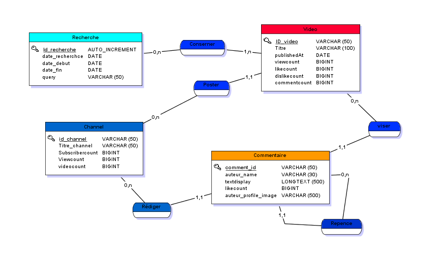

# Presentation of the app
This app is developed with java and uses Youtube Api to query data. it's only the back-end there is no GUI.

# How to make it work ?
## Get your app key
First you should create a application Key from [google developers](https://developers.google.com/youtube/v3).
After that you will get you client secret file on json format
__client_secret.json__
```json
{
    "installed":{
        "client_id":"Your client id",
        "project_id":"Your project id",
        "auth_uri":"https://accounts.google.com/o/oauth2/auth",
        "token_uri":"https://www.googleapis.com/oauth2/v3/token",
        "auth_provider_x509_cert_url":"https://www.googleapis.com/oauth2/v1/certs",
        "client_secret":"Your secret key",
        "redirect_uris":[
            "urn:ietf:wg:oauth:2.0:oob",
            "http://localhost"
            ]
    }
}
```

> Place your client_secret.json file in to [resources folder](./YoutubeApi/src/main/resources) folder

## Create the data base
While the app uses the API to retrieve data, it will store it in your local database.
By default, the application uses **the Oracle database system**, but feel free to use any other database system you are comfortable with. To do this, you simply need to modify the jdbc settings for your database connectivity in the [Database.java](./YoutubeApi/src/main/java/Database.java) file

Here is the schema you should have in your database:


>Simply run the sql file **dataYoutubeApi.sql** to implement the schema.
---
:clap: huppy coding :hearts: